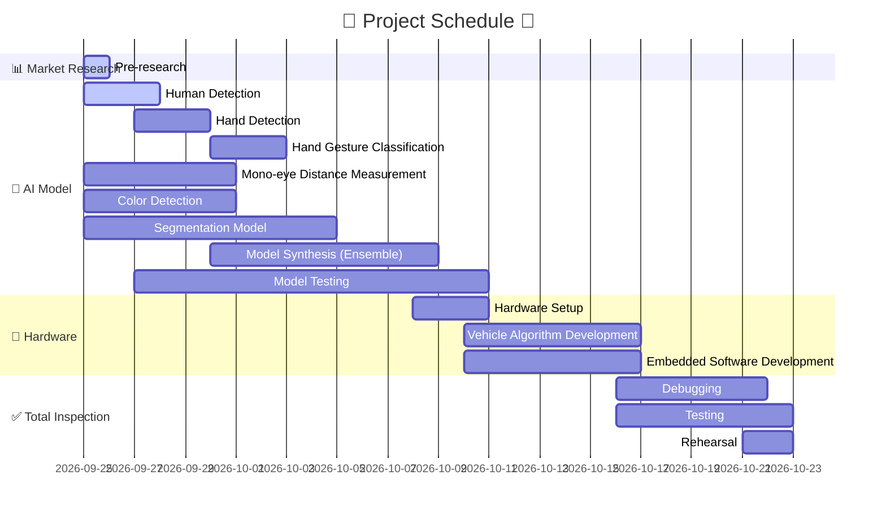
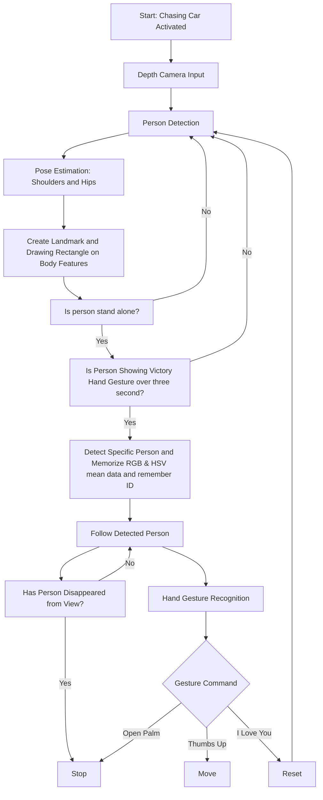
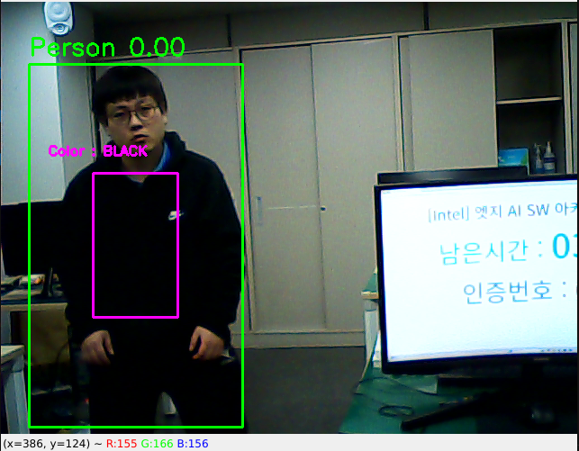
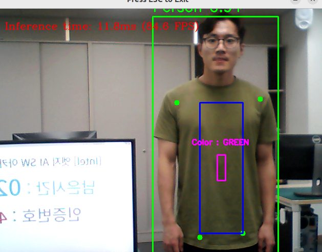
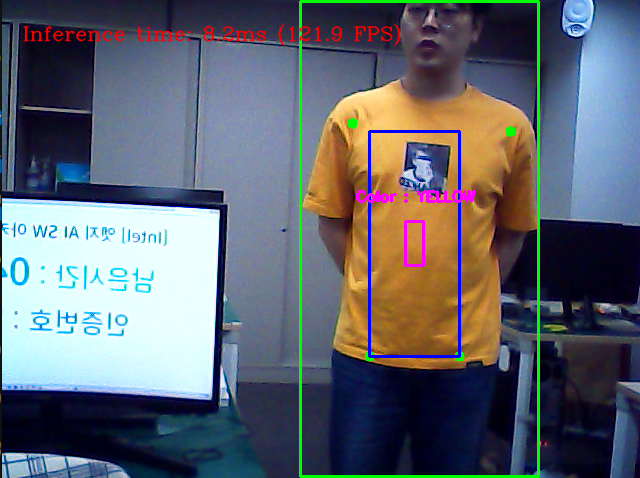

# 🛒Human Detection Auto Driving Shopping Cart Project
이번 AI 프로젝트는 사람의 편의성을 위해서 사람을 자동으로 추적하여 따라다니는 쇼핑카트를 제작하는 것에 목표를 두었습니다.
기기 의존성을 최소화하기 위해 웨어러블 기기를 사용하지 않고 카트에 있는 Depth Camera와 AI만을 가지고 사람을 찾고 추적합니다.

# 📅Project Gantt Chart

# 🔄Software Flow Chart

# 🔧Action Method
## 1️⃣HLD1 (젯슨나노에서 모델을 돌리기 어려운 경우)

## 2️⃣HLD2 (젯슨나노에서 모델을 돌릴 수 있을 경우)

# 🔍Human Detect Method
사람을 추적하는 방식은 여러 개를 사용하였습니다.
- 첫번째로 Color Classification AI Model을 이용하여 사람의 상의 색을 특징을 추출하여 이를 비교하여 사람을 추적합니다.
- 두번째로 openCV를 사용하여 영역 안에 있는 색의 RGB와 HSV의 평균 값을 바탕으로 이를 비교하여 사람을 추적합니다.
- 마지막으로 deepSORT를 사용하여 사람의 특징을 추출하고 ID를 부여하여 그 ID를 가진 사람을 추적합니다.

## 1️⃣Color Classification Model

- 사람을 감지하면 pose detection 모델로 양쪽 어깨, 양쪽 골반의 landmark를 추출하여 사각형을 그림
- 사각형 안에서 더 작은 영역을 추출하여 색을 판단함.
- 총 10개의 클래스로 나뉨. ['black', 'yellow', 'brown', 'green', 'orange', 'pink', 'purple', 'red', 'white', 'blue']

## 2️⃣Color Check with OpenCV

- 사람을 감지하면 pose detection 모델로 양쪽 어깨, 양쪽 골반의 landmark를 추출하여 사각형을 그림
- 사각형 내부의 색(RGB, HSV)의 평균을 구해 이를 저장함.
- 추후에 평균 값을 바탕으로 사람을 추적함.

## 3️⃣deepSORT Model

- deepSORT 모델을 사용하여 사람의 ID를 부여.
- 감지한 사람에 ID를 부여하여 추적
- 사람이 90FPS 동안 사라졌을 경우 ID를 삭제하고 다른 ID를 부여함.

# 🖌Result
## 🎨Color Result

-  등록된 사람의 색만을 감지하여 추적하여 그 사람만을 따라서 이동

## 🆔deepSORT Result

-  deepSORT로 detection된 사람의 ID를 추적하여 그 사람만을 따라서 이동

# ✅finished job
1. ROS를 통한 turtle bot control ✅
2. jetson nano와 intel realsense connection ✅
3. 라즈베리에서 intel realsense 사용 불가 ✅
4. mediapipe 를 사용한 hand gesture recognition ✅
5. ROS-dashing을 이용하여 intel realsense로부터 입력받은 gesture 명령에 따른 turtle-bot 제어 ✅
6. HLD1 동작 ✅
7. Sound 출력 명령 생성 ✅
8. 사람을 따라다니는 기본 알고리즘 구상 ✅
9. 사람의 상의 색을 판단하여 추적하는 알고리즘 ✅
10. deepSORT를 이용한 사람 판별 알고리즘 ✅

# 🛠️Roles
은찬, 태섭 : 최종 하드웨어 구성, 시나리오에 따른 터틀봇 동작 구상, HLD2 진행  
동현, 의근 : 최종 하드웨어 구성, realsense camera 연동, 사람 추적 알고리즘 개발(deepSORT), 색판별 알고리즘 개발(Color Classification), frame내 사람 위치에 따른 터틀봇 움직임 변화 logic개발

https://docs.google.com/presentation/d/1Lx77uSf5PYn2l2sOHIAY5sZOlxNl3XysMNC4QXFoowY/edit#slide=id.g3060aae8cd2_1_7
