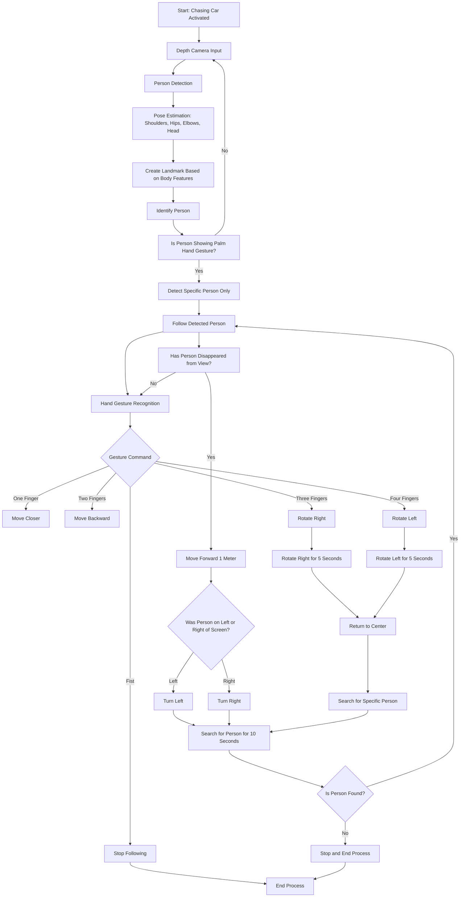

# openvino-AI-project
Gihub got openvino AI project(Human chasing mobility)

# Project Gantt Chart

# Software Flow Chart

# HLD1 (젯슨나노에서 모델을 돌리기 어려운 경우)

# HLD2 (젯슨나노에서 모델을 돌릴 수 있을 경우)

# finished job
1. ROS를 통한 turtle bot control Check
2. jetson nano와 intel realsense connection Check
3. 라즈베리에서 intel realsense 사용 불가 Check
4. mediapipe 를 사용한 hand gesture recognition Check

# current job
은찬, 태섭 : 통신 속도 정상화, turtlebot 제어 코드 refactoring, frame 처리 및 동작 제어 threading ,제스쳐 명령 수행 
동현, 의근 : 
