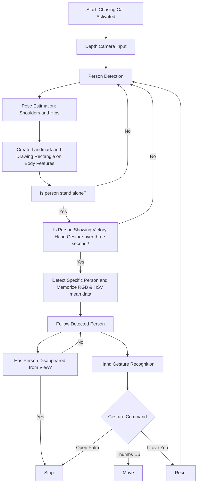
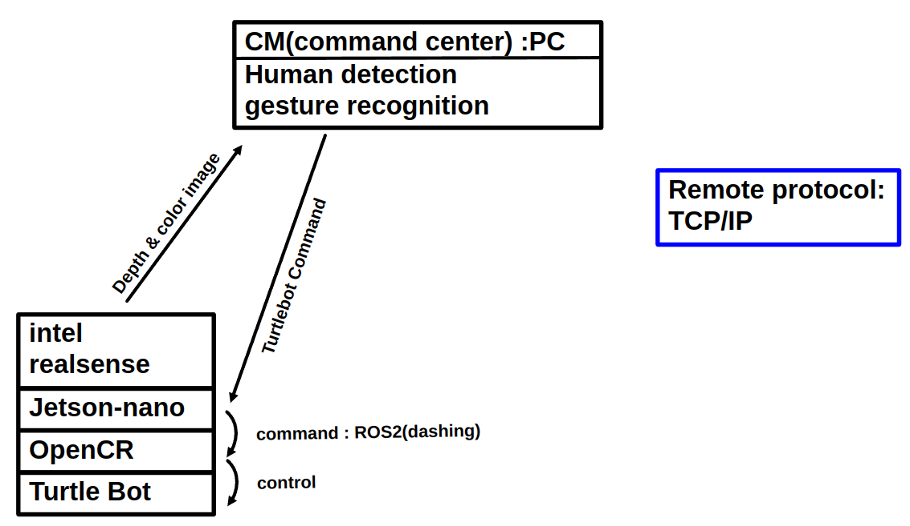
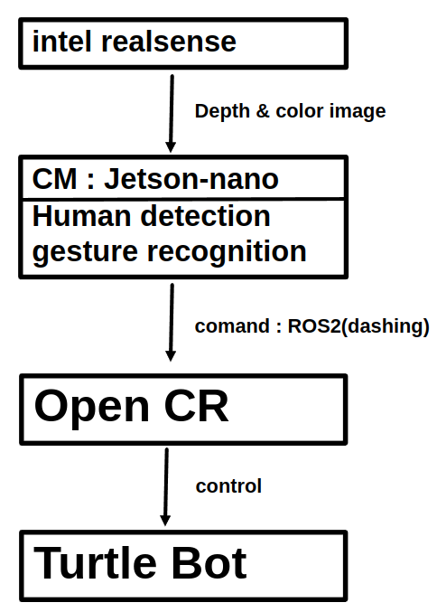

# openvino-AI-project
Gihub got openvino AI project(Human chasing mobility)

# Project Gantt Chart

# Software Flow Chart

# HLD1 (젯슨나노에서 모델을 돌리기 어려운 경우)

# HLD2 (젯슨나노에서 모델을 돌릴 수 있을 경우)

# finished job
1. ROS를 통한 turtle bot control Check
2. jetson nano와 intel realsense connection Check
3. 라즈베리에서 intel realsense 사용 불가 Check
4. mediapipe 를 사용한 hand gesture recognition Check
5. ROS-dashing을 이용하여 intel realsense로부터 입력받은 gesture 명령에 따른 turtle-bot 제어 Check
6. HLD1 동작 Check
7. Sound 출력 명령 생성 Check
8. 사람을 따라다니는 기본 알고리즘 구상 Check
9. 

# current job
은찬, 태섭 : 최종 하드웨어 구성, 시나리오에 따른 터틀봇 동작 구상, HLD2 진행  
동현, 의근 : 

https://docs.google.com/presentation/d/1Lx77uSf5PYn2l2sOHIAY5sZOlxNl3XysMNC4QXFoowY/edit#slide=id.g3060aae8cd2_1_7
